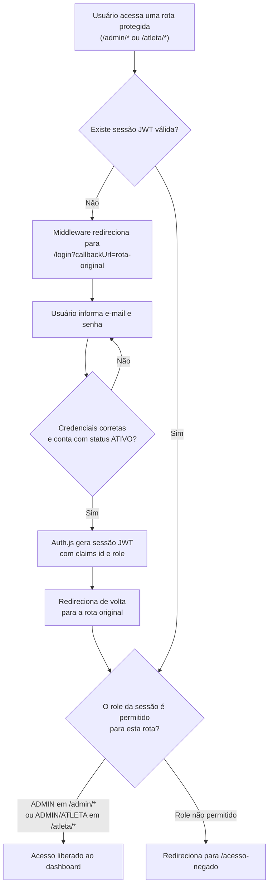
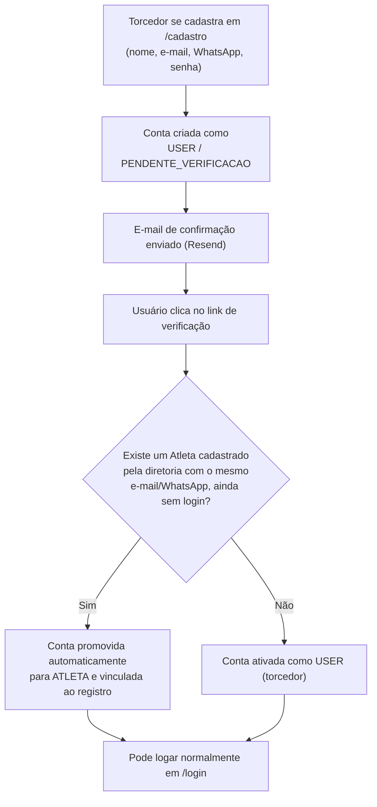

# Planalto Futsal

PWA oficial do **Planalto Futsal**, equipe de futebol e futsal de várzea do Jardim Planalto,
Sancho — Zona Oeste do Recife-PE.

---

## 1. Sobre a Aplicação

O Planalto Futsal nasceu como um time de várzea da comunidade, e este aplicativo existe para dar a ele uma casa digital: um canal direto entre a diretoria, os atletas e a torcida.

O objetivo central é **conectar a comunidade ao time**, levando informação de forma simples e
acessível — sem depender só de grupo de WhatsApp ou boca a boca:

- **Para a torcida**: saber quando e onde é o próximo jogo, ver fotos do time (antigas e atuais),
  contribuir com uma doação via Pix, oferecer ou pedir carona para os jogos, acompanhar avisos da
  diretoria e votar em enquetes.
- **Para os atletas**: ter um perfil próprio dentro do time, com foto, posição, estilo de jogo e
  os campeonatos em que está inscrito.
- **Para a diretoria**: centralizar a gestão do elenco, o financeiro do clube, os campeonatos
  disputados e a moderação do conteúdo que a torcida envia — tudo em um só lugar, com registro de
  auditoria das ações mais sensíveis (aprovação de fotos, cadastro/desativação de atleta,
  movimentações financeiras).

Por trás da interface, a aplicação segue princípios de **Clean Architecture** e **DDD**: as regras
de negócio (entidades e casos de uso) não dependem de framework nem de banco de dados, o que
mantém o sistema fácil de entender, testar e evoluir — mesmo sendo mantido por um time pequeno.

---

## 2. Como Executar Localmente

### Pré-requisitos

- [Node.js](https://nodejs.org/) 20 ou superior
- Uma conexão com um cluster MongoDB (ex: [MongoDB Atlas](https://www.mongodb.com/atlas), tier
  gratuito M0 é suficiente)
- (Opcional, para o e-mail de confirmação de cadastro funcionar de verdade) uma conta na
  [Resend](https://resend.com/)

### Passo a passo

1. **Clonar o repositório e instalar as dependências**

   ```bash
   git clone https://github.com/Hugoleosilva/PlanaltoFutsal.git
   cd PlanaltoFutsal
   npm install
   ```

2. **Configurar as variáveis de ambiente**

   Copie o arquivo de exemplo e preencha com seus próprios valores:

   ```bash
   cp .env.example .env.local
   ```

   Variáveis obrigatórias em `.env.local`:

   | Variável | Descrição |
   | --- | --- |
   | `MONGODB_URI` | String de conexão do MongoDB (Atlas ou local) |
   | `MONGODB_DB_NAME` | Nome do banco (padrão: `planalto-futsal`) |
   | `AUTH_SECRET` | Segredo do Auth.js — gere com `npx auth secret` |
   | `AUTH_URL` | URL base da aplicação (`http://localhost:3001` em dev) |
   | `RESEND_API_KEY` | Chave da Resend para envio de e-mail transacional. Sem ela, os e-mails só são logados no console do servidor (útil em dev) |
   | `RESEND_FROM_EMAIL` | Remetente dos e-mails (padrão de teste: `Planalto Futsal <onboarding@resend.dev>`) |

3. **Criar a primeira conta ADMIN**

   O sistema não tem um usuário administrador por padrão — a primeira conta precisa ser criada
   por um script de bootstrap que fala direto com o banco:

   ```bash
   npm run seed:admin -- seu-email@exemplo.com "SuaSenhaForte123"
   ```

4. **Rodar em modo de desenvolvimento**

   ```bash
   npm run dev
   ```

   A aplicação sobe em [http://localhost:3001](http://localhost:3001) (porta 3001 para não
   conflitar com outros projetos rodando na 3000).

5. **Outros comandos úteis**

   ```bash
   npm run typecheck     # checagem de tipos TypeScript
   npm run lint          # ESLint
   npm test              # roda a suíte de testes (Vitest)
   npm run test:coverage # roda os testes com relatório de cobertura
   npm run build          # build de produção
   npm start              # sobe o build de produção (porta 3001)
   ```

---

## 3. Estrutura do Projeto

O projeto segue **Clean Architecture**: as regras de negócio (`core`) não conhecem detalhes de
infraestrutura (banco, e-mail, autenticação) nem de interface — a dependência sempre aponta para
dentro.

```text
PlanaltoFutsal/
├── src/
│   ├── app/                        # Next.js App Router — rotas, páginas e Server Actions
│   │   ├── admin/                  # Painel da Diretoria (ROLE: ADMIN)
│   │   │   ├── financeiro/
│   │   │   ├── elenco/
│   │   │   ├── campeonatos/
│   │   │   ├── jogos/
│   │   │   ├── moderacao/
│   │   │   └── conteudo/
│   │   ├── atleta/                 # Painel do Atleta (ROLE: ATLETA)
│   │   ├── cadastro/               # Cadastro público (ROLE: USER)
│   │   ├── login/
│   │   ├── api/                    # Route Handlers (auth, upload de arquivos, fotos)
│   │   └── _components/            # Seções da Landing Page (Portal Público)
│   │
│   ├── core/                       # Regras de negócio — sem dependência de framework
│   │   ├── domain/                 # Entidades, Value Objects e contratos de repositório
│   │   │   ├── atleta/  campeonato/  financeiro/  foto/  jogo/  carona/
│   │   │   ├── engajamento/  patrocinio/  loja/  lgpd/  audit/  user/
│   │   │   └── entity.ts           # Classe base de toda Entidade
│   │   └── use-cases/              # Casos de uso (1 classe = 1 ação de negócio)
│   │       └── _shared/            # Ports compartilhados (auth, hash, e-mail, upload)
│   │
│   ├── infrastructure/             # Implementações concretas dos contratos do core
│   │   ├── database/               # Conexão Mongoose, schemas e repositórios
│   │   ├── security/               # Auth.js (config edge-safe + Node + middleware)
│   │   ├── audit/                  # Trilha de auditoria de ações críticas
│   │   ├── errors/                 # AppError e subclasses + handler centralizado
│   │   ├── notifications/          # Envio de e-mail (Resend / fallback console)
│   │   └── storage/                # Upload de imagens (armazenadas no MongoDB)
│   │
│   ├── shared/                     # Código reaproveitável entre camadas
│   │   ├── components/ui/          # Componentes visuais (Button, Input, Card...)
│   │   ├── validation/             # Validator + regras de validação reutilizáveis
│   │   ├── types/  utils/  constants/
│   │
│   ├── middleware.ts                # Controle de rotas por Role (RBAC)
│   └── graphify/                    # Resumos do estado da aplicação (contexto para IA)
│
├── tests/                           # Testes unitários (Vitest) espelhando src/core
│   ├── core/domain/  core/use-cases/
│   ├── shared/
│   └── fakes/                       # Repositórios fake para testar Use Cases isoladamente
│
├── scripts/
│   └── seed-admin.mjs                # Bootstrap da primeira conta ADMIN
│
├── skills-and-prompts/               # Skills/prompts reaproveitáveis para gerar novos módulos
└── public/                           # Assets estáticos, ícones e manifest do PWA
```

**Regra de dependência**: `app` → `core/use-cases` → `core/domain`, e `infrastructure` implementa
interfaces definidas em `core`. Nenhum arquivo em `core/` importa de `app/` ou `infrastructure/`.

---

## 4. Fluxo de Autenticação

Todo acesso a uma rota protegida (`/admin/*` ou `/atleta/*`) passa pelo `middleware.ts`, que decide
se libera, redireciona para o login ou bloqueia por falta de permissão:



> **Por que o middleware usa uma config de auth separada:** `src/middleware.ts` roda no **Edge
> Runtime** da Vercel/Next.js, que não suporta Mongoose nem `node:crypto`. Por isso a configuração
> do Auth.js é dividida em três arquivos — `auth.config.ts` (regras puras, sem acesso a banco),
> `auth.ts` (versão completa, com o Credentials Provider, usada nas rotas Node.js) e
> `auth.edge.ts` (usada só pelo middleware, sem provider nenhum — apenas lê o JWT).

### Como uma conta ganha acesso (cadastro + verificação)

Existem três caminhos para alguém virar `ATLETA`, pensados para o dia a dia real do clube: a
diretoria cadastra o nome do jogador no elenco antes dele ter login (caso comum em times de
várzea), e o sistema faz a ligação automaticamente assim que a pessoa confirma o e-mail:



Além desse fluxo automático, a diretoria também pode, a qualquer momento, **promover manualmente**
um torcedor já cadastrado para atleta (painel Elenco → "Promover torcedor para atleta"), ou
**emitir credenciais diretas** para um atleta que ainda não tem conta (Elenco → "Criar acesso de
login") — nesse caso, sem passar por verificação de e-mail.
